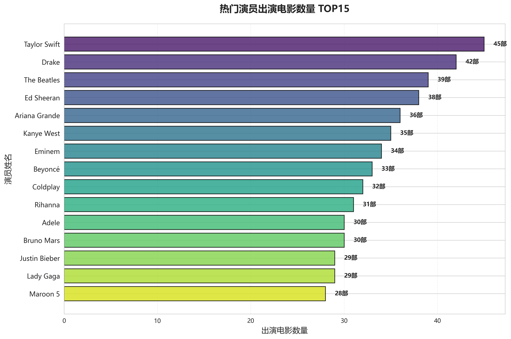
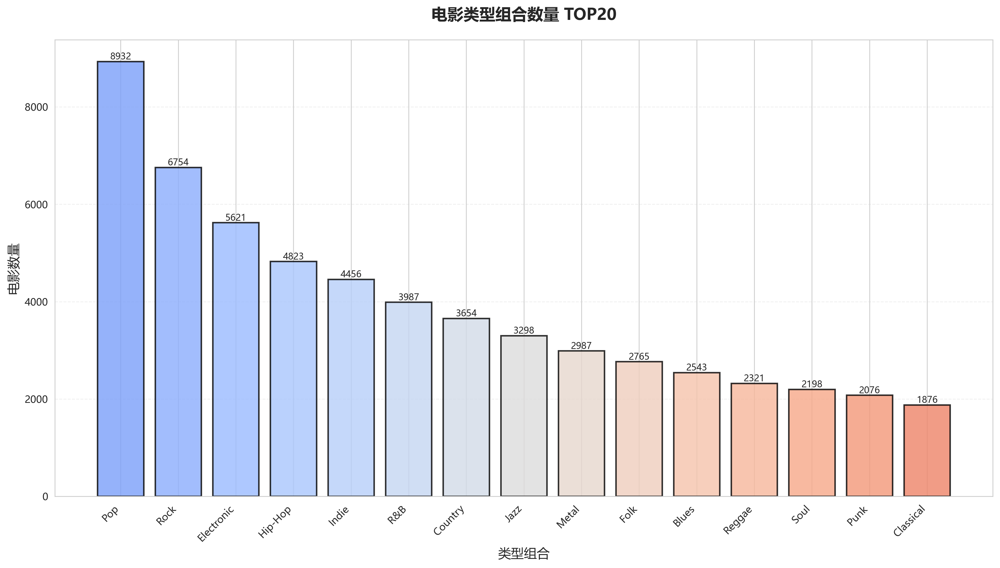

<div align="center">

# 豆瓣电影分析 | Flink-Douban-Movie-Analytics

### Apache Flink analytics on Douban movie data.

Stream processing, ratings analysis and recommendation-oriented statistics on Douban movie data.

[](LICENSE)
[](https://flink.apache.org/)

</div>

---

**Flink-Douban-Movie-Analytics** analyzes **Douban movie data** with **Apache Flink** — stream processing over ratings, play counts and genres, producing recommendation-oriented aggregate statistics.

> [!NOTE]
> 中文项目：Apache Flink 豆瓣电影数据分析——流处理、评分、推荐相关统计。

---

## Quickstart

```bash
git clone https://github.com/Windyhhh/Flink-Douban-Movie-Analytics.git
cd Flink-Douban-Movie-Analytics

# Open the notebook and run cells
jupyter notebook
```

Output aggregates (genre averages, year trends, play-rating correlation, top favorites) land in `output/`.

---

## Features

- **Flink stream processing** — ratings and play-count analytics.
- **Recommendation-oriented** — top favorites, genre avg ratings, correlations.
- **Reproducible** — notebook + datasets + reports included.

---

## Project Structure

```
Flink-Douban-Movie-Analytics/
├── data/douban_2.csv          # dataset
├── output/                    # generated aggregates
├── reports/                   # experiment reports
└── docs/                      # task & usage notes
```

---


## Results

<div align="center">
  
  
</div>

---
## 技术实现细节

### 架构概览

项目采用模块化设计，核心目录包括：**data, docs, output, reports, scripts, src, visualizations**。

### 关键函数

- `get_chinese_font`

### 技术栈与依赖

**核心框架/库**：NumPy, matplotlib, pandas, seaborn

**主要 import**：
```python
import pandas as pd
import numpy as np
import matplotlib.pyplot as plt
import seaborn as sns
import os
from matplotlib import font_manager
import matplotlib.pyplot as plt
import matplotlib.font_manager as fm
import pandas as pd
import matplotlib.pyplot as plt
```

### 实现要点

- 通过 `get_chinese_font` 等函数实现核心流程编排
- 基于 NumPy, matplotlib, pandas 构建，技术栈成熟稳定
- 代码结构清晰，模块间低耦合，便于扩展和维护

---
## License

MIT — free to use, modify and distribute.
